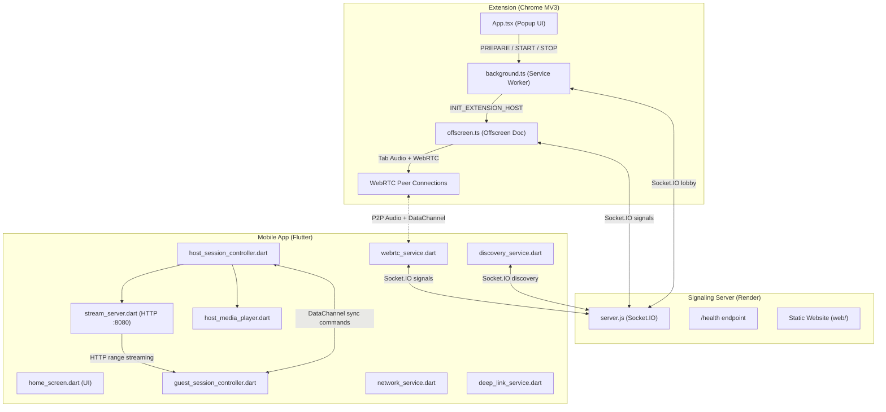

# Synchronization — Architecture Analysis

## System Design Overview



## How Things Work

### Flow 1: Extension → Phone (Browser Audio)
1. User clicks **Start Streaming** in the extension popup
2. `App.tsx` calls `chrome.tabCapture.getMediaStreamId()` to get a stream ID
3. `background.ts` creates an offscreen document and sends the stream ID to it
4. `offscreen.ts` captures the tab audio via `getUserMedia` with the stream ID
5. `offscreen.ts` connects to the signaling server via Socket.IO
6. Mobile app joins the same session room via Socket.IO
7. `offscreen.ts` creates a WebRTC offer (with audio track attached) and sends it through the signaling server
8. Mobile app creates a WebRTC answer, ICE candidates are exchanged
9. **Audio flows P2P** via WebRTC — the server is NOT in the audio path
10. A DataChannel is also established for sync commands (play/pause/seek)

### Flow 2: Phone → Phone (LAN Host)
1. Host phone picks a media file via `file_service.dart`
2. `host_session_controller.dart` starts `stream_server.dart` (HTTP server on port 8080)
3. `network_service.dart` determines the local IP address (handles WiFi, hotspot, tethering)
4. Host connects to the signaling server, announces the session, shows QR code
5. Guest scans QR or enters session code, joins via signaling server
6. WebRTC DataChannel is established for sync commands
7. Host sends a `streamReady` command with the HTTP URL (`http://<host-ip>:8080/audio`)
8. Guest's `just_audio` player loads and plays from that HTTP URL
9. Host sends `syncCheck` commands every 500ms with its current position
10. Guest uses **EMA-filtered drift correction**: small drifts adjust speed ±5%, large drifts hard-seek

---

## What's Actually Good (Honest Assessment)

| Aspect | Rating | Notes |
|--------|--------|-------|
| **Sync algorithm** | ⭐⭐⭐⭐ | RTT calibration, EMA filtering, soft/hard correction — this is genuinely well-designed, AmpMe-level |
| **Network detection** | ⭐⭐⭐⭐ | Handles WiFi, hotspot, tethering with smart IP scoring |
| **Stream server** | ⭐⭐⭐⭐ | Proper HTTP range requests, CORS, audio-only MIME type mapping |
| **Extension architecture** | ⭐⭐⭐ | Clean separation (popup → background → offscreen), proper state management |
| **Deep linking** | ⭐⭐⭐ | Handles both custom scheme and HTTPS app links |
| **Discovery** | ⭐⭐⭐ | Auto-discovery of nearby hosts via signaling server works well |

---

## Bugs Found

### 🔴 Bug 1: Discovery service reconnection capped at 15

[discovery_service.dart:L68](file:///c:/Synchronization/mobile/lib/services/discovery_service.dart#L68):
```dart
.setReconnectionAttempts(15)
```

Same issue we fixed in `webrtc_service.dart` — if the signaling server is temporarily down (Render cold start), the discovery gives up after 15 attempts and stops finding hosts.

**Fix:** Change to a high number like `9999999`.

---

### 🔴 Bug 2: Memory leak — Guest audio renderers never disposed on peer disconnect

[webrtc_service.dart:L299-L303](file:///c:/Synchronization/mobile/lib/services/webrtc_service.dart#L299-L303):

When a peer connection goes to `failed`/`closed`, the peer is removed from `_peers`, but the `RTCVideoRenderer` objects created in `_attachRemoteAudio()` are **never cleaned up**. They keep holding references to dead `MediaStream` objects. Over multiple reconnections, this leaks memory.

**Fix:** Track which renderers belong to which peer and dispose them on disconnect.

---

### 🔴 Bug 3: Offscreen.ts has a dead `answer` and `ice-candidate` handler

[offscreen.ts:L111-L134](file:///c:/Synchronization/extension/src/offscreen.ts#L111-L134):

The offscreen script listens for **both** `'signal'` events (the actual signaling path used by `server.js`) AND legacy `'answer'`/`'ice-candidate'` events. The server never emits `'answer'` or `'ice-candidate'` — it only relays via the `'signal'` event. These are dead code from an earlier version.

**Impact:** Not a crash bug, but confusing and adds unnecessary event listeners.

**Fix:** Remove the `answer` and `ice-candidate` handlers.

---

### 🟡 Bug 4: Stream server port 8080 is hardcoded — can conflict

[stream_server.dart:L8](file:///c:/Synchronization/mobile/lib/services/stream_server.dart#L8):
```dart
static const int port = 8080;
```

Port 8080 is one of the most commonly used ports. If another app is using it, `shelf_io.serve` will throw and the session will fail with an unhelpful error.

**Fix:** Try port 8080 first, fall back to 8081-8085 if it's in use.

---

### 🟡 Bug 5: Guest doesn't handle host disconnect gracefully

When the host ends the session or their phone goes to sleep:
1. The WebRTC peer connection goes to `failed`
2. ICE restart is attempted (good)
3. But the guest's `just_audio` player is still trying to fetch from `http://<host-ip>:8080/audio` — the HTTP server is gone
4. `just_audio` will throw errors in the background, but the UI still shows "Sync: In Sync"

**Fix:** Listen for `just_audio` error events and update the UI state.

---

### 🟡 Bug 6: Deep link auto-connect doesn't update the UI state

[app.dart:L50-L54](file:///c:/Synchronization/mobile/lib/app.dart#L50-L54):
```dart
_deepLinkService.onDeepLink = (sessionId, serverUrl) {
  final webrtc = context.read<WebRTCService>();
  webrtc.initializeGuest(GuestSessionController());
  webrtc.connect(sessionId, serverUrl);
};
```

This connects as a guest, but `HomeScreen`'s `_mode` is still `_ScreenMode.welcome`. The WebRTC state changes propagate via `Consumer<WebRTCService>`, but the `_mode` variable (which controls which page is shown) is never updated to `guestActive`. The user sees the welcome screen while already connected.

**Fix:** Use a callback or shared state to update `_mode` when a deep link connects.

---

### 🟢 Bug 7: `_broadcastPlayback` sends same stale command on delay

[host_session_controller.dart:L276-L278](file:///c:/Synchronization/mobile/lib/services/host_session_controller.dart#L276-L278):
```dart
Future<void>.delayed(const Duration(milliseconds: 100), () {
  _broadcast(command);
});
```

If the user taps play, then immediately taps pause within 100ms, the delayed replay will send a stale `play` command after the `pause` — causing guests to un-pause.

**Fix:** Cancel any pending replay when a new playback command is issued.

---

## Can We Make a Better Version?

**Honest answer: The core architecture is solid.** The sync algorithm, the WebRTC signaling flow, and the LAN streaming approach are all well-designed. This isn't a "throw it away and rewrite" situation. But there are meaningful improvements that would make it production-grade:

### Tier 1: Fix the bugs above (1-2 hours)
These are real bugs that users will hit. Fixing them costs almost nothing.

### Tier 2: Resilience improvements (half a day)
- **Socket reconnection everywhere** → unlimited (already done for WebRTC, not for discovery)
- **Guest handles host disappearance** → show "Host disconnected" instead of frozen UI
- **Stream server port fallback** → try multiple ports

### Tier 3: Architecture improvements (if you want to invest time)

| Improvement | Effort | Impact |
|-------------|--------|--------|
| **Replace hardcoded server URL** with a config/env variable across all files | Low | Makes deployment flexible |
| **Add a "connection quality" indicator** using the existing RTT data (you already collect it!) | Low | Users can see if their connection is degrading |
| **Error boundary in extension popup** — right now any React crash shows a white screen | Low | Better UX |
| **Foreground service on Android** for host mode — prevents OS from killing the app during long sessions | Medium | Critical for 1+ hour sessions |
| **WebRTC audio for phone-to-phone** (instead of HTTP streaming) — would eliminate the need for same-WiFi | High | Major feature change |

### Things I would NOT change
- The sync algorithm is genuinely good — don't touch it
- The offscreen document pattern for tab capture is the correct Chrome MV3 approach
- The signaling server is appropriately minimal — it's a relay, not application logic
- Using `just_audio` and `video_player` is the right choice for Flutter media playback
