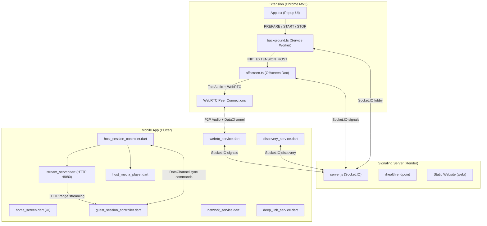

# Synchronization — Architecture Analysis

## System Design Overview

## How Things Work

### Flow 1: Extension → Phone (Browser Audio)
1. User clicks **Start Streaming** in the extension popup
2. `App.tsx` calls `chrome.tabCapture.getMediaStreamId()` to get a stream ID
3. `background.ts` creates an offscreen document and sends the stream ID to it
4. `offscreen.ts` captures the tab audio via `getUserMedia` with the stream ID
5. `offscreen.ts` connects to the signaling server via Socket.IO
6. Mobile app joins the same session room via Socket.IO
7. `offscreen.ts` creates a WebRTC offer (with audio track attached) and sends it through the signaling server
8. Mobile app creates a WebRTC answer, ICE candidates are exchanged
9. **Audio flows P2P** via WebRTC — the server is NOT in the audio path
10. A DataChannel is also established for sync commands (play/pause/seek)

### Flow 2: Phone → Phone (LAN Host)
1. Host phone picks a media file via `file_service.dart`
2. `host_session_controller.dart` starts `stream_server.dart` (HTTP server on port 8080)
3. `network_service.dart` determines the local IP address (handles WiFi, hotspot, tethering)
4. Host connects to the signaling server, announces the session, shows QR code
5. Guest scans QR or enters session code, joins via signaling server
6. WebRTC DataChannel is established for sync commands
7. Host sends a `streamReady` command with the HTTP URL (`http://<host-ip>:8080/audio`)
8. Guest's `just_audio` player loads and plays from that HTTP URL
9. Host sends `syncCheck` commands every 500ms with its current position
10. Guest uses **EMA-filtered drift correction**: small drifts adjust speed ±5%, large drifts hard-seek

---

## What's Actually Good (Honest Assessment)

| Aspect | Rating | Notes |
|--------|--------|-------|
| **Sync algorithm** | ⭐⭐⭐⭐ | RTT calibration, EMA filtering, soft/hard correction — this is genuinely well-designed, AmpMe-level |
| **Network detection** | ⭐⭐⭐⭐ | Handles WiFi, hotspot, tethering with smart IP scoring |
| **Stream server** | ⭐⭐⭐⭐ | Proper HTTP range requests, CORS, audio-only MIME type mapping |
| **Extension architecture** | ⭐⭐⭐ | Clean separation (popup → background → offscreen), proper state management |
| **Deep linking** | ⭐⭐⭐ | Handles both custom scheme and HTTPS app links |
| **Discovery** | ⭐⭐⭐ | Auto-discovery of nearby hosts via signaling server works well |

---

## Can We Make a Better Version?

**Honest answer: The core architecture is solid.** The sync algorithm, the WebRTC signaling flow, and the LAN streaming approach are all well-designed. This isn't a "throw it away and rewrite" situation. With the recent bug fixes and resilience improvements (like socket reconnection, handling host disappearance, and stream port fallback), the app is now much closer to production-grade.

### Next Steps / Potential Architecture Improvements (if you want to invest time)

| Improvement | Effort | Impact |
|-------------|--------|--------|
| **Replace hardcoded server URL** with a config/env variable across all files | Low | Makes deployment flexible |
| **Add a "connection quality" indicator** using the existing RTT data (you already collect it!) | Low | Users can see if their connection is degrading |
| **Error boundary in extension popup** — right now any React crash shows a white screen | Low | Better UX |
| **Foreground service on Android** for host mode — prevents OS from killing the app during long sessions | Medium | Critical for 1+ hour sessions |
| **WebRTC audio for phone-to-phone** (instead of HTTP streaming) — would eliminate the need for same-WiFi | High | Major feature change |

### Things I would NOT change
- The sync algorithm is genuinely good — don't touch it
- The offscreen document pattern for tab capture is the correct Chrome MV3 approach
- The signaling server is appropriately minimal — it's a relay, not application logic
- Using `just_audio` and `video_player` is the right choice for Flutter media playback
